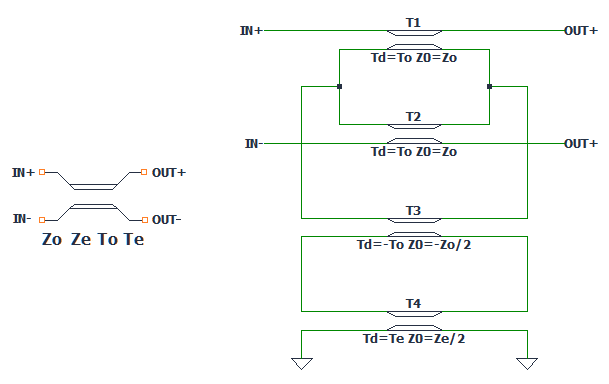

# Differential Pair Transmission Line Model for LTSpice

## Abstract

This repository presents a differential pair transmission line model implemented in LTSpice. The model is constructed using built-in lossless transmission line elements and is intended for the simulation and analysis of differential interconnects based on their even- and odd-mode parameters.

The formulation follows the methodology described in:

> *Validation Methods for S-parameter Measurement Based Models of Differential Transmission Lines*  
> https://www.researchgate.net/publication/255648346_Validation_Methods_for_S-parameter_Measurement_Based_Models_of_Differential_Transmission_Lines

___

## 1. Introduction

Differential transmission lines are widely used in high-speed digital and analog systems due to their superior noise immunity and controlled impedance characteristics. Accurate modeling of such structures is essential for signal integrity analysis.

This work implements a simplified LTSpice-compatible model based on decoupled even- and odd-mode transmission line parameters.

___

## 2. Model Description

The proposed model is constructed using ideal (lossless) transmission line elements available in LTSpice. The differential behavior is derived from the following parameters:

- Odd-mode impedance: \( Z_{odd} \)  
- Even-mode impedance: \( Z_{even} \)  
- Odd-mode propagation delay: \( T_{odd} \)  
- Even-mode propagation delay: \( T_{even} \)

These parameters fully define the differential transmission line behavior under the assumptions of linearity and lossless propagation.

Depending on the physical geometry of the interconnect, these parameters can be extracted using standard transmission line calculators or electromagnetic solvers.
___

## 3. Repository Structure

Differential Pair Transmission lines model/ 
│── LICENSE 
│── README.md 
│── Differential_TLine_Model_examples.ipynb 
│── Examples 
│── diff_tline_ltspice.zip 
-    │──diff_tline.asc 
-    │──diff_tline.asc 
-    │──diff_tline.lib 
-    │──diff_tline.sub 
___

## 4. Installation in LTSpice

To install and use the model in LTSpice:

1. Copy `diff_tline.asy` into the LTSpice symbol directory:  
*\your_path\LTspice\lib\sym*

2. Copy `diff_tline.lib` into the LTSpice subcircuit directory: 
*\your_path\LTspice\lib\sub*

3. Launch LTSpice.

4. Insert the component by searching for `diff_tline`.

5. Add the following directive to the schematic: 
*.include diff_tline.lib*

___

## 5. Notebook Description

The provided Jupyter notebook:

> `Differential_TLine_Model_examples.ipynb`

contains a detailed description of the model formulation and simulation examples illustrating its use in 
___

## 6. Examples

The repository includes multiple simulation examples organized as follows:

│── Examples 
-    │── [Example1](/Examples/Ex1_XTalk_NEXT_FEXT.asc): Near-end & Far-End pulse 
-    │── [Example2](/Examples/Ex2_XTalk_NEXT_FEXT_vs_Length.asc): NEXT & FEXT versus coupling length 
-    │── [Example3](/Examples/Ex3_XTalk_vs_Spacing.asc): NEXT & FEXT versus trace spacing 
-    │── [Example4](/Examples/Ex4_XTalk_NEXT_FEXT_vs_RT.asc): NEXT & FEXT versus rise time 

Each example demonstrates different configurations and parameter sets for differential transmission line analysis.

---

## 7. Conclusion

This repository provides a practical LTSpice implementation of a differential transmission line model based on even/odd-mode decomposition. The model is intended for educational and engineering applications in signal integrity analysis.

---

## References

[1] *Validation Methods for S-parameter Measurement Based Models of Differential Transmission Lines*, available at:  
https://www.researchgate.net/publication/255648346_Validation_Methods_for_S-parameter_Measurement_Based_Models_of_Differential_Transmission_Lines

[2] *A Configuration-Oriented SPICE Model for Multiconductor Transmission Lines in an Inhomogeneous Medium*, IEEE Transactions on Microwave Theory and Techniques, Vol. 46, No. 12, December 1998 

---

## License

This project is licensed under the MIT License. See the [LICENSE](LICENSE) file for details.

---

## Disclaimer

This software and its associated documentation are provided "as is", without warranty of any kind, either express or implied. In no event shall the authors, contributors, or their affiliated company be held liable for any damages, losses, or consequences arising from the use, misuse, or inability to use this software.

Use of this material is entirely at your own risk. The authors and their affiliated company make no representations or guarantees regarding the accuracy, reliability, or suitability of the content for any particular purpose.

By using this software, you acknowledge that you are solely responsible for any outcomes resulting from its use.